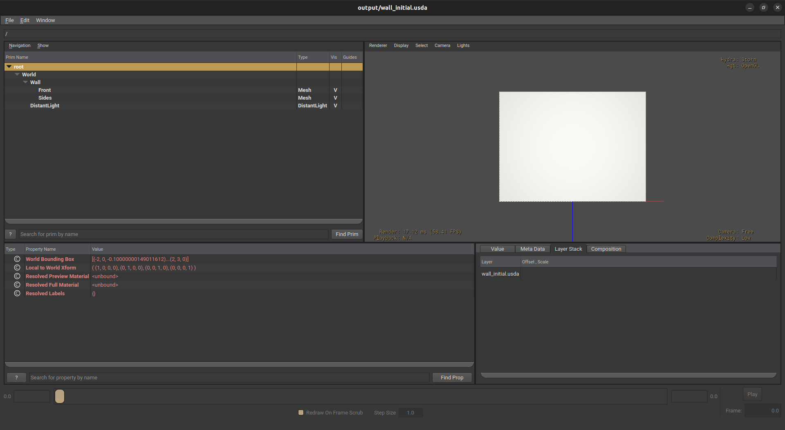
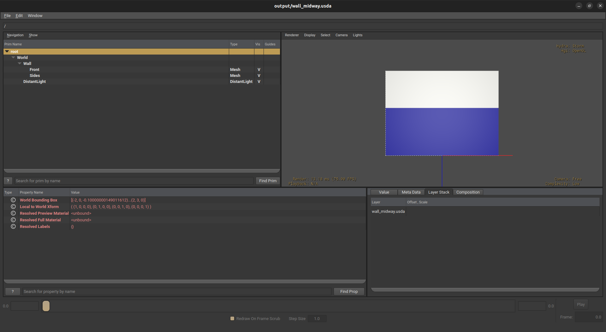
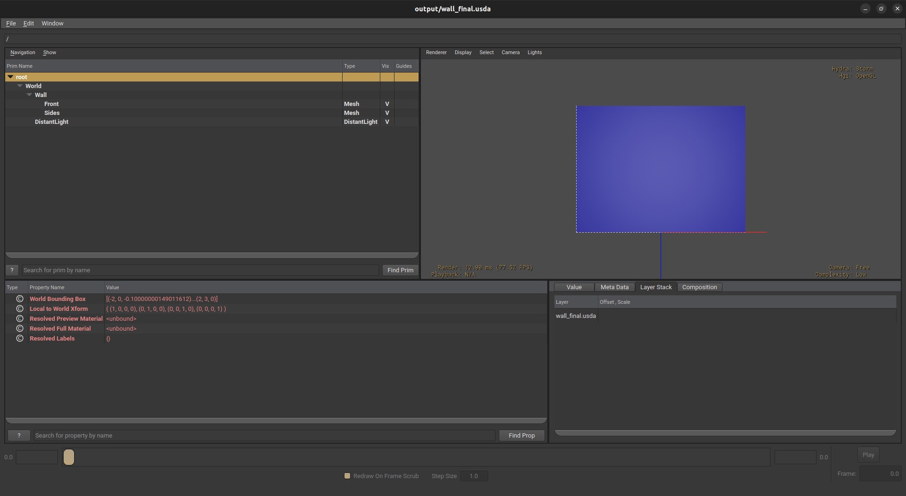

# Simulated Paint Spraying on a Wall Mesh

Spray paint simulation using **Isaac Warp** for GPU-accelerated simulation
and **OpenUSD** for geometry and visualization.

## Project Structure
```
paint_sim/
├── config.py          # All configurable parameters
├── wall.py            # Task 1: Cuboid wall mesh (OpenUSD)
├── spray.py           # Task 2: Spray simulation (Isaac Warp kernels)
├── paint.py           # Task 3: Paint accumulation
├── nozzle_path.py     # Task 5: Animated nozzle zigzag path
├── main.py            # Task 4: Visualization + runs simulation
├── output/            # Generated USD files
└── textures/          # Generated texture images
```

## Requirements

- Python 3.8+
- Isaac Warp (`pip install warp-lang`)
- OpenUSD (`pip install usd-core`)
- NumPy (`pip install numpy`)

## How to Run
```bash
python3 main.py
```

## View Results in usdview
```bash
usdview output/wall_initial.usda    # Empty wall (before)
usdview output/wall_midway.usda     # Half painted (during)
usdview output/wall_final.usda      # Fully painted (after)
usdview output/spray_animation.usda # Animation (press Play)
```

Press `4` in usdview to remove wireframe.

## Configurable Parameters (config.py)

| Parameter | Value | Description |
|-----------|-------|-------------|
| WALL_WIDTH | 4.0m | Wall width |
| WALL_HEIGHT | 3.0m | Wall height |
| WALL_DEPTH | 0.1m | Wall thickness |
| FAN_ANGLE | 0.5 rad | Spray fan spread |
| SPRAY_RANGE | 2.0m | Max spray distance |
| SPRAY_DENSITY | 800 | Particles per step |
| NUM_PASSES | 10 | Zigzag passes |

## Screenshots

### Initial State (before spraying)


### Intermediate Step (midway)


### Final Result (fully painted)


## Animation Video

https://github.com/joyalrajajony02-byte/spray-paint-simulation/raw/main/output/spray_video.mp4
